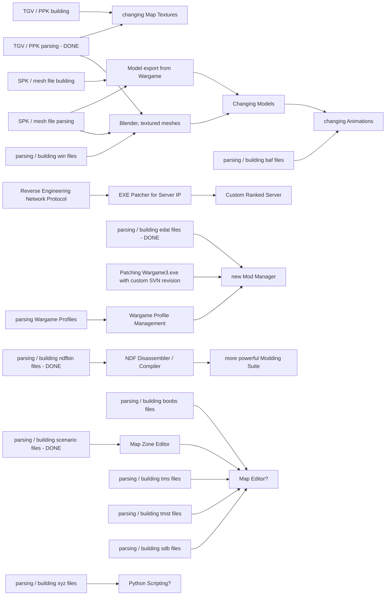

# Roadmap

See it as a ToDo list or a list of planned / nice-to-have features for Wargame modding:

```mermaid
graph LR
TGV_parse[TGV / PPK parsing - DONE] --> Texture[changing Map Textures]
TGV_build[TGV / PPK building] --> Texture
unicorn[Model export from Wargame]
SPK_parse[SPK / mesh file parsing] --> unicorn
SPK_build[SPK / mesh file building] --> unicorn
unicorn --> Model[Changing Models]
baf_parse[parsing / building baf files] --> Model_Animation[changing Animations]
Model --> Model_Animation

Blender[Blender, textured meshes]
TGV_parse --> Blender
SPK_parse --> Blender
win[parsing / building win files] --> Blender
Blender --> Model

network[Reverse Engineering Network Protocol] --> network_patcher[EXE Patcher for Server IP] --> network_server[Custom Ranked Server]

Edat[parsing / building edat files - DONE]
Edat --> Manager[new Mod Manager]
EXE_patcher[Patching Wargame3.exe with custom SVN revision] --> Manager
Profile_parser[parsing Wargame Profiles] --> Manager_profile[Wargame Profile Management] --> Manager

NDF[parsing / building ndfbin files - DONE]
NDF --> NDF_compiler[NDF Disassembler / Compiler]
NDF_compiler --> ModdingSuite[more powerful Modding Suite]

Maps[Map Editor?]
boobs[parsing / building boobs files] --> Maps
Maps_zones[Map Zone Editor]
scenario[parsing / building scenario files - DONE] --> Maps_zones --> Maps
tms[parsing / building tms files] --> Maps
tmst[parsing / building tmst files] --> Maps
sdb[parsing / building sdb files] --> Maps

xyz_parser[parsing / building xyz files] --> python[Python Scripting?]
```
